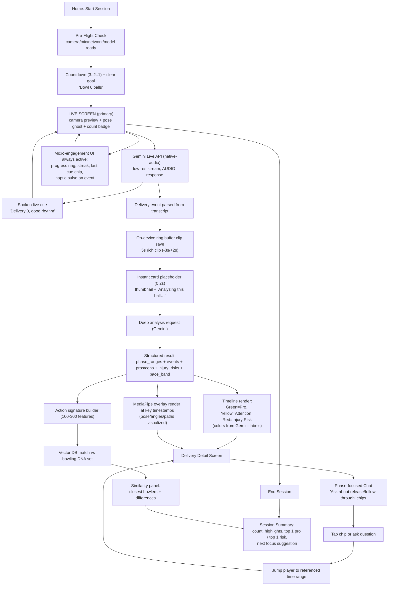

# Hackathon Flowchart + UX Engagement Design

Date: 2026-02-26
Scope: Gemini Live API hackathon flow emphasizing continuous user engagement.

## Flowchart (system + UX)



## Label ownership (important)
- MediaPipe does not assign semantic labels like `PRO/ATTENTION/INJURY_RISK`.
- Gemini deep analysis assigns those labels with timestamp evidence.
- App applies color mapping:
  - `PRO -> Green`
  - `ATTENTION -> Yellow`
  - `INJURY_RISK -> Red`

## UX anti-idle rules
1. Every waiting moment must show progress + purpose text.
2. After each delivery, show immediate placeholder card before deep analysis completes.
3. Keep multi-sensory event confirmation (audio + visual badge + haptic).
4. Keep one-tap actions available while analysis runs (`Replay`, `Ask about release`, `Next ball`).
5. Start chat with quick phase chips to avoid blank-state friction.
6. End session with exactly one prioritized next focus area.

## Suggested deep-analysis response contract
```json
{
  "phase_ranges": [{"name": "release", "start_s": 2.1, "end_s": 2.8}],
  "events": [{"type": "release", "time_s": 2.42}],
  "pros": [{"label": "Stable head", "time_s": 2.3, "evidence": "..."}],
  "cons": [{"label": "Late trunk collapse", "time_s": 3.1, "evidence": "..."}],
  "injury_risks": [{"label": "Front-knee overload", "severity": "medium", "time_s": 2.9, "evidence": "..."}],
  "pace_band": {"label": "medium", "range_kph": "95-105", "confidence": 0.74},
  "signature_vector": [0.123, 0.456, 0.789]
}
```
