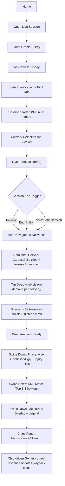
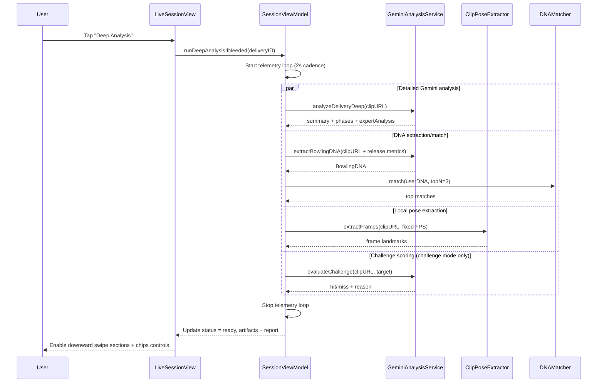
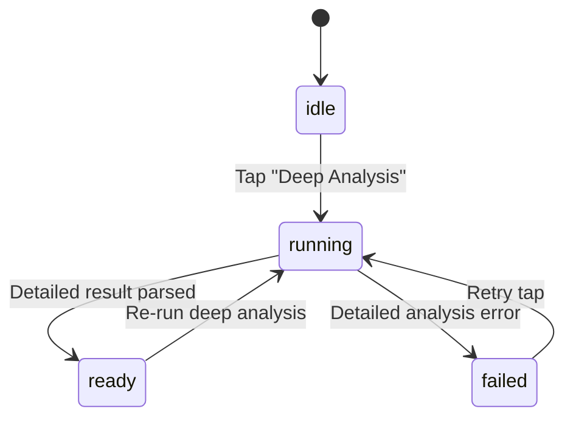
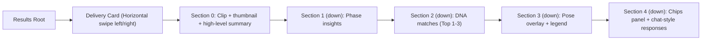

# Live Session + Deep Analysis Diagrams

**Date**: 2026-03-03  
**Repo**: `/Users/kanarupan/workspace/wellbowled.ai`  
**Scope**: Current app flow (Home -> Live session), end-session results, per-delivery deep analysis, async execution.

## 1) End-to-End Demo Flow (4 minutes)

## 2) On-Demand Deep Analysis Async Pipeline

## 3) Per-Delivery Deep Analysis State Machine

## 4) Results Navigation Model

